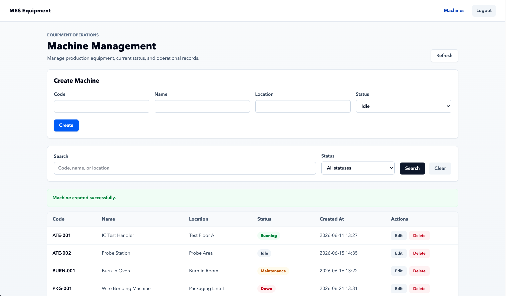
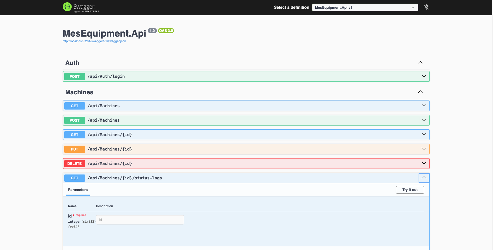
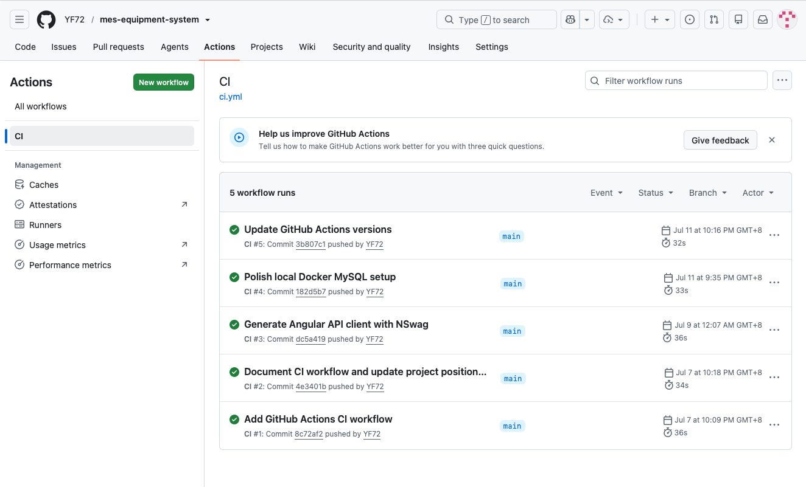
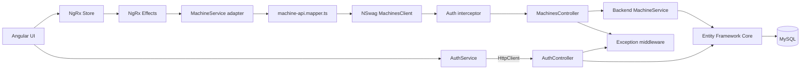

# MES Equipment Management System

[](https://github.com/YF72/mes-equipment-system/actions/workflows/ci.yml)


A portfolio-scale full-stack MES equipment management system built with ASP.NET Core, Angular, and MySQL for tracking machines, operational status, and status-change history in an internal MES-style workflow.

The project goes beyond CRUD by focusing on the boundaries that keep a full-stack application maintainable: DTO-based API contracts, generated client isolation, database-backed authentication, server-side querying, centralized error handling, automated tests, and continuous integration.

The backend OpenAPI contract generates the Angular API client through NSwag. After regenerating the client and running the Angular build, DTO changes surface as TypeScript compile-time feedback instead of remaining as silent runtime mismatches. Generated transport types remain behind a frontend service adapter and mapper, while the rest of the Angular application works with its own models.

## Table of Contents

- [Engineering Highlights](#engineering-highlights)
- [Screenshots](#screenshots)
- [Tech Stack](#tech-stack)
- [Architecture](#architecture)
- [Request Flow](#request-flow)
- [Local Setup](#local-setup)
- [Demo Accounts](#demo-accounts)
- [API Overview](#api-overview)
- [Testing](#testing)
- [Continuous Integration](#continuous-integration)
- [Design Decisions](#design-decisions)
- [Project Structure](#project-structure)
- [Demo Script](#demo-script)
- [Engineering Scope](#engineering-scope)

## Engineering Highlights

- **Equipment workflows** — machine CRUD, server-side pagination, keyword search, status filtering, and per-machine status history
- **Contract-driven integration** — Angular API client generated from the live backend OpenAPI contract with NSwag
- **Clear frontend boundary** — generated clients are wrapped by `MachineService`, while `machine-api.mapper.ts` converts transport DTOs into application models
- **Role-based access control** — database-backed users, hashed passwords, JWT role claims, backend authorization policies, Angular role-aware controls, route guards, and centralized frontend 401 handling
- **Consistent API behavior** — DTO validation at the request boundary and unhandled exceptions returned as `ProblemDetails`
- **Automated verification** — service-level tests, API integration tests through `WebApplicationFactory`, and GitHub Actions for pushes and pull requests targeting `main`

Machine status history is recorded only when the status actually changes. Updating another field does not create a duplicate `MachineStatusLog` entry.

## Screenshots

### Machine Management UI



### Swagger API Contract



### GitHub Actions CI



## Tech Stack

| Layer          | Technologies                                                                                                      |
| -------------- | ----------------------------------------------------------------------------------------------------------------- |
| Backend        | .NET 9, ASP.NET Core Web API, C#, Entity Framework Core 9, MySQL 8.4 through Pomelo                               |
| Authentication | JWT Bearer authentication, `PasswordHasher<User>`, .NET User Secrets, JWT role claims, policy-based authorization |
| API            | DTO and Service layers, DataAnnotations validation, `ProblemDetails`, Swagger/OpenAPI, NSwag 14                   |
| Frontend       | Angular 21.2, TypeScript 5.9, NgRx 21.1, Angular Signals, Reactive Forms, Tailwind CSS 4                          |
| Testing        | xUnit, EF Core InMemory provider, `WebApplicationFactory`                                                         |
| Infrastructure | Docker Compose, GitHub Actions                                                                                    |

## Architecture



NSwag generates `AuthClient` and `MachinesClient` from the backend OpenAPI contract. The machine workflow uses `MachinesClient` through a frontend `MachineService` adapter. `machine-api.mapper.ts` converts generated request and response types into the application's `Machine` model, keeping generated code out of components and NgRx effects.

Authentication remains intentionally simpler. `AuthService` sends the login request through Angular `HttpClient` because login is a single request-response operation with no shared query state to coordinate.

NgRx manages the machine-list query state: page, page size, keyword, status filter, loading state, error state, and returned records. Create, update, and delete are one-off operations. The component calls `MachineService`, uses Signals for local operation feedback, and reloads the list after success. This keeps shared query behavior centralized without routing every local mutation through additional actions and effects.

## Request Flow

A machine-list request follows this path:

```text
Angular component
    ↓ dispatches load action
NgRx effect
    ↓
Frontend MachineService adapter
    ↓
machine-api.mapper.ts
    ↓
NSwag-generated MachinesClient
    ↓ HTTP
MachinesController
    ↓
Backend MachineService
    ↓
Entity Framework Core
    ↓
MySQL
```

The response returns through the same boundary, is mapped into frontend application models, stored in NgRx, and rendered by the Angular UI.

## Local Setup

### Prerequisites

- .NET SDK
- Node.js and npm
- Docker Desktop
- EF Core CLI tools

Install the EF Core CLI if it is not already available:

```bash
dotnet tool install --global dotnet-ef
```

### 1. Clone the repository

```bash
git clone https://github.com/YF72/mes-equipment-system.git
cd mes-equipment-system
```

### 2. Start MySQL

Create a local environment file from the example:

```bash
cp .env.example .env
```

Start the database:

```bash
docker compose up -d
docker ps
```

Wait until the MySQL container reports `healthy`.

The default local configuration is:

```text
Root password: root_password
Database:      mes_equipment_db
User:          mes_user
Password:      mes_password
Port:          3307
```

These values are local-development defaults and can be overridden in `.env`.

### 3. Configure backend secrets

```bash
cd backend/MesEquipment.Api

dotnet user-secrets init
dotnet user-secrets set "Jwt:Key" "your-development-secret-key-at-least-32-characters"
dotnet user-secrets set "Jwt:Issuer" "MesEquipment.Api"
dotnet user-secrets set "Jwt:Audience" "MesEquipment.Web"
```

The JWT signing key is intentionally kept out of `appsettings.json`. A production environment should provide JWT and database credentials through environment variables or a secret manager.

### 4. Apply migrations and run the API

```bash
dotnet ef database update
dotnet run
```

```text
API:     http://localhost:5264
Swagger: http://localhost:5264/swagger
```

### 5. Generate the Angular API client

Keep the backend running. From the repository root:

```bash
cd ../..

dotnet tool restore
dotnet tool run nswag run nswag.json
```

Generated file:

```text
MesEquipment.Web/src/app/api/mes-equipment-api.ts
```

Do not edit the generated file manually. Change the backend contract or `nswag.json`, then regenerate the client.

### 6. Run the frontend

```bash
cd MesEquipment.Web
npm install
npm start
```

```text
App: http://localhost:4200
```

## Demo Accounts

The following accounts are seeded only in the Development environment:

| Username     | Password   | Role                         | Machine permissions          |
| ------------ | ---------- | ---------------------------- | ---------------------------- |
| `admin`      | `password` | Administrator                | Read, create, update, delete |
| `ee`         | `password` | Equipment Engineer           | Read, create, update, delete |
| `ee.manager` | `password` | Equipment Manager            | Read                         |
| `quality`    | `password` | Quality Engineer             | Read                         |
| `eng`        | `password` | Engineering                  | Read, update                 |
| `pei`        | `password` | Process Integration Engineer | Read, update                 |

`DbSeeder` creates these demo accounts on startup in the Development environment. Public registration is intentionally excluded because this project models an internal MES application where accounts are provisioned rather than self-registered.

## API Overview

| Method   | Endpoint                                                      | Notes                                                              |
| -------- | ------------------------------------------------------------- | ------------------------------------------------------------------ |
| `POST`   | `/api/Auth/login`                                             | Returns a JWT; authentication is not required                      |
| `GET`    | `/api/Machines?Page=1&PageSize=10&Keyword=cnc&Status=Running` | Server-side pagination; `Keyword` and `Status` are optional        |
| `GET`    | `/api/Machines/{id}`                                          | Returns one machine                                                |
| `POST`   | `/api/Machines`                                               | Creates a machine                                                  |
| `PUT`    | `/api/Machines/{id}`                                          | Updates a machine and writes a status log only when status changes |
| `DELETE` | `/api/Machines/{id}`                                          | Deletes a machine                                                  |
| `GET`    | `/api/Machines/{id}/status-logs`                              | Returns status-change history for one machine                      |

All `/api/Machines/*` endpoints require:

```http
Authorization: Bearer <token>
```

Machine endpoint permissions are enforced by backend authorization policies:

| Role                         | Read | Create | Update | Delete |
| ---------------------------- | ---- | ------ | ------ | ------ |
| Administrator                | Yes  | Yes    | Yes    | Yes    |
| Equipment Engineer           | Yes  | Yes    | Yes    | Yes    |
| Equipment Manager            | Yes  | No     | No     | No     |
| Quality Engineer             | Yes  | No     | No     | No     |
| Engineering                  | Yes  | No     | Yes    | No     |
| Process Integration Engineer | Yes  | No     | Yes    | No     |

The Angular UI hides unavailable actions for usability, but backend authorization policies remain the security boundary.

Supported machine statuses:

```text
Idle
Running
Down
Maintenance
```

DTO validation rejects unsupported status values on write requests.

## Testing

The backend includes service-level tests for business behavior and API integration tests for the real ASP.NET Core request pipeline.

Run the complete .NET test suite from the repository root:

```bash
dotnet test MesEquipment.sln
```

### Service-level coverage

`MachineServiceTests.cs` covers:

- server-side pagination
- keyword search
- status filtering
- machine creation
- retrieving a machine by ID
- updating a machine
- deleting a machine
- writing a status-history entry when status changes
- avoiding a status-history entry when status does not change

The status-history tests protect a real regression. An earlier implementation of `MachineService.UpdateAsync` constructed a `MachineStatusLog` object but did not add it to the `DbContext`, so the history record was never persisted. The regression pair now verifies both sides of the rule: a status change must create a log, while an unrelated update must not.

### API integration coverage

`AuthApiTests.cs`, `MachinesApiTests.cs`, and `MachineAuthorizationTests.cs` use `WebApplicationFactory` to exercise the application through HTTP rather than calling controllers directly.

Coverage includes:

- a protected machine endpoint returns `401 Unauthorized` without a token
- valid credentials return a JWT and the user's assigned role
- an authenticated machine-list request returns paged data
- an invalid machine DTO returns `400 Bad Request`
- a Quality user can read machines but receives `403 Forbidden` when creating one
- an Engineering user can update machines but receives `403 Forbidden` when deleting one
- ASP.NET Core authentication, authorization, and validation run through the actual middleware pipeline

The integration-test host replaces the MySQL configuration with the EF Core InMemory provider and uses test-specific JWT settings, so tests do not require Docker or a running MySQL instance.

Each `CustomWebApplicationFactory` instance uses a unique InMemory database name. This prevents users and machines created by one test from leaking into another test.

## Continuous Integration

GitHub Actions runs on pushes and pull requests to `main`.

The backend job:

```text
Restore dependencies
Build the solution
Run dotnet test
```

The frontend job:

```text
Install dependencies with npm ci
Run the Angular production build
```

Workflow configuration:

```text
.github/workflows/ci.yml
```

The CI badge at the top of this README reflects the current workflow result.

## Design Decisions

### ASP.NET Core Web API instead of MVC

The frontend is an independent Angular SPA, so the backend exposes HTTP APIs rather than server-rendered views. This keeps presentation concerns in Angular and request, business, and persistence concerns in ASP.NET Core.

### DTOs instead of exposing EF Core entities

Controllers accept and return DTOs rather than database entities. The API contract can therefore evolve independently from persistence details, and request validation stays at the boundary instead of being spread across controllers and services.

### Service layer for business behavior

Controllers handle HTTP concerns. `MachineService` owns querying, persistence, and status-history rules. Keeping status-change logging in the service makes the rule testable without depending on a controller or browser workflow.

### Generated client instead of hand-written TypeScript contracts

Maintaining backend DTOs and TypeScript interfaces separately creates two sources of truth. NSwag generates the Angular client from the OpenAPI contract, turning contract drift into a build-time failure.

### Adapter and mapper around generated code

Generated code is infrastructure, not the frontend domain model. `MachineService` and `machine-api.mapper.ts` prevent generated DTOs and client behavior from spreading through components and NgRx effects. Regenerating the client therefore has a smaller impact on the application.

### NgRx for shared query state

Pagination, filters, loading, errors, and returned records form one shared query state used across the machine-list UI. NgRx coordinates that state and its asynchronous loading flow. One-off create, update, and delete feedback remains local to the component through Signals.

### Narrow global exception handling

The exception middleware converts unhandled exceptions into a consistent `ProblemDetails` response. It does not replace built-in framework behavior: DTO validation still produces `400` responses, and authentication still produces `401` responses.

### User Secrets for local development

The JWT signing key does not belong in source control. .NET User Secrets keeps it outside tracked configuration during local development. Deployment environments should use environment variables or a managed secret store instead.

## Project Structure

```text
project-root/
├── MesEquipment.sln
├── backend/
│   ├── MesEquipment.Api/
│   │   ├── Authorization/
│   │   ├── Controllers/
│   │   ├── Data/
│   │   ├── DTOs/
│   │   ├── Middleware/
│   │   ├── Models/
│   │   └── Services/
│   └── MesEquipment.Api.Tests/
│       ├── Integration/
│       └── Services/
├── MesEquipment.Web/
│   └── src/app/
│       ├── adapters/
│       │   └── machine-api.mapper.ts
│       ├── api/
│       │   └── mes-equipment-api.ts
│       ├── guards/
│       ├── models/
│       ├── pages/
│       ├── services/
│       └── store/machines/
├── .config/
│   └── dotnet-tools.json
├── .github/workflows/
│   └── ci.yml
├── .env.example
├── docker-compose.yml
└── nswag.json
```

## Demo Script

1. Open `/machines` while logged out and show the route guard redirecting to `/login`.
2. Sign in with the demo account.
3. Search by keyword, filter by status, and change pages.
4. Create a machine.
5. Update the machine without changing its status.
6. Update the machine again and change its status.
7. Call `GET /api/Machines/{id}/status-logs` in Swagger and show the new history record.
8. Delete the machine and point out the local loading, success, and error feedback.
9. Run `dotnet test MesEquipment.sln`.
10. Open the GitHub Actions workflow and show the backend tests and Angular build passing on the same commit.

## Engineering Scope

This repository is a portfolio-scale vertical slice through equipment management: Angular UI, state management, generated API integration, authentication, backend services, persistence, validation, error handling, automated tests, and CI.

It is not presented as a complete enterprise MES. A production system would also require concerns such as organization-level identity and access management, audit and compliance controls, equipment communication protocols, event-driven integration, observability, deployment automation, high availability, backup and recovery, and multi-site support.

Those concerns remain outside the current scope so the implemented workflow stays clear, runnable, and testable.
